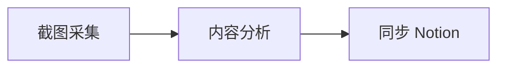

# AlieZVzz Blog

这是我的个人博客，记录 AI、知识管理、自动化实践，以及独立产品的设计与开发过程。

访问网站：[https://aliezvzz.github.io](https://aliezvzz.github.io)

## 内容方向

- AI、NLP 与 Human-centered AI
- AI Agent 与个人工作流自动化
- Notion、知识管理与数字化复盘
- 独立产品的设计、开发和实践总结

## 网站功能

- 使用 Markdown 编写文章
- 响应式布局，适配桌面端和移动端
- 支持标签、归档、分页和文章目录
- 按文章启用 Mermaid 流程图
- 按文章启用 MathJax 数学公式
- 自动生成 RSS Feed、Sitemap 和 SEO 元数据
- 支持通过 Utterances 使用 GitHub Issues 评论

## 技术栈

- [GitHub Pages](https://pages.github.com/)
- [Jekyll](https://jekyllrb.com/) 与 `github-pages`
- Liquid、Kramdown、Sass
- [Mermaid](https://mermaid.js.org/)
- [MathJax](https://www.mathjax.org/)
- [Utterances](https://utteranc.es/)

网站基于 [LOFFER](https://github.com/FromEndWorld/LOFFER) 主题持续定制。

## 项目结构

```text
.
├── _config.yml                  # 网站全局配置
├── _includes/                   # 可复用页面组件
├── _layouts/                    # 页面和文章布局
├── _posts/                      # 博客文章
├── _sass/                       # Sass 变量和组件样式
├── archive/                     # 文章归档页
├── attachments/                 # 文章附件
├── images/                      # 图片、头像和站点图标
├── tags/                        # 标签页
├── .github/workflows/           # GitHub Actions 构建检查
├── about.md                     # 关于页面
├── Gemfile                      # Ruby 依赖
└── style.scss                   # 站点样式入口
```

## 本地运行

推荐使用 Ruby 3.2，与 GitHub Actions 的构建环境保持一致。

```bash
bundle install
bundle exec jekyll serve
```

然后访问 [http://127.0.0.1:4000](http://127.0.0.1:4000)。

执行生产环境构建：

```bash
JEKYLL_ENV=production bundle exec jekyll build
```

生成的网站位于 `_site/`。

## 发布文章

在 `_posts/` 中创建名称符合以下格式的 Markdown 文件：

```text
YYYY-MM-DD-slug.md
```

推荐使用下面的 Front Matter：

```yaml
---
layout: post
title: "文章标题"
date: 2026-07-30
author: AlieZVzz
description: "用于文章列表和搜索结果的简短介绍"
tags: [AI Agent, Notion]
comments: true
toc: true
mermaid: true
math: false
---
```

配置说明：

- `comments`：是否显示 Utterances 评论区
- `toc`：是否生成文章目录
- `mermaid`：是否加载 Mermaid 并渲染流程图
- `math`：是否加载 MathJax 并渲染数学公式

可以在正文中加入 `<!-- more -->`，控制首页文章摘要的截断位置。

### Mermaid

文章设置 `mermaid: true` 后，可以直接使用 Mermaid 代码块：

````markdown

````

### 数学公式

文章设置 `math: true` 后，可以使用行内公式 `$E = mc^2$` 或块级公式：

```text
$$
\nabla_\theta J(\theta)
$$
```

## 评论配置

评论系统使用 Utterances，相关配置位于 `_config.yml`：

```yaml
comments_provider: utterances
utterances:
  repo: AlieZVzz/aliezvzz.github.io
  issue_term: pathname
  label: blog-comments
  theme: github-light
```

首次启用前，需要为仓库安装 [Utterances GitHub App](https://github.com/apps/utterances)。只有设置了 `comments: true` 的文章才会显示评论区。

## 修改网站

- 网站标题、描述、导航、分页和评论：修改 `_config.yml`
- 字体、颜色和断点：修改 `_sass/_variables.scss`
- 全局样式：修改 `style.scss` 和 `_sass/` 下的组件文件
- 页面结构：修改 `_layouts/` 和 `_includes/`
- 头像与图标：替换 `images/logo.png` 和 `images/favicon.png`

## 构建与发布

提交并推送到 `master` 分支后，GitHub Pages 会按照仓库的 Pages 配置发布网站。

`.github/workflows/jekyll-build.yml` 会在推送和 Pull Request 时执行生产构建，用于提前发现依赖、模板或内容错误。

## 致谢

感谢以下开源项目：

- [LOFFER](https://github.com/FromEndWorld/LOFFER)
- [Jekyll](https://jekyllrb.com/)
- [jekyll-toc](https://github.com/allejo/jekyll-toc)
- [Open Color](https://yeun.github.io/open-color/)

## License

本项目采用 [MIT License](LICENSE)。
