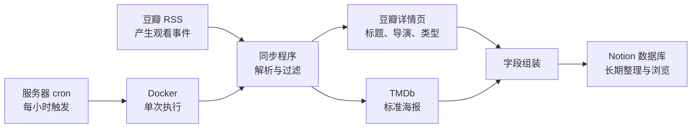

看电影和记录电影，对我来说一直是两件分开的事。

豆瓣适合标记“看过”、评分和写一句短评；Notion 更适合长期整理，可以按年份、类型、导演和评分建立不同视图，也能把电影记录放进整个个人知识系统里。问题是，如果每看完一部电影都要手动复制标题、日期、导演、类型和海报，我很快就会放弃维护。

所以我想做的并不是另一个电影应用，而是一条安静运行的管道：

> 我只在豆瓣完成一次“看过”，剩下的事情交给程序。

这个想法最早在 2022 年被我写成几个 Python 脚本。几年后，我又把它重新整理为 [Douban-Notion-Movie-Sync](https://github.com/AlieZVzz/Douban-Notion-Movie-Sync)：从豆瓣 RSS 读取最近的观看记录，补全电影元数据和海报，去重后写入 Notion，并通过 Docker 和 cron 在服务器上每小时运行。

这篇文章记录的，是这套电影工作流如何一步步长出来。

<!-- more -->

## 第一版：先解决历史数据，再考虑自动化

最开始面对的问题不是“下一部电影怎么同步”，而是豆瓣账号中已经积累了很多历史记录。

我当时把这件事拆成了两个阶段。

第一阶段是一次性初始化：

1. 通过 Tampermonkey 脚本导出豆瓣中所有“看过”的电影；
2. 整理导出的 CSV 字段；
3. 把 CSV 导入 Notion，建立最初的电影数据库；
4. 再运行更新脚本，补充 CSV 中缺少的导演、类型和封面。

第二阶段才是增量同步：

1. 订阅豆瓣个人主页提供的 RSS；
2. 读取最近新增的“看过”记录；
3. 与 Notion 中已有电影比较；
4. 只写入数据库中不存在的电影。

这个拆分后来被一直保留了下来：**全量迁移和日常增量，本来就是两种不同的问题。**

历史数据只需要搬一次，不应该在每次任务中重新抓取；日常同步则应该足够轻量，能够频繁执行，而且重复运行不会制造重复记录。

## 从能用的脚本，到可以长期运行的工作流

第一版已经能完成任务，但它仍然很像一组“需要我记得怎么运行”的脚本：

- 数据库 ID、Token 和 Cookie 需要手动填入代码；
- 初始化、元数据补全和增量同步分散在不同文件中；
- 豆瓣图片直接引用时可能失效；
- 运行依赖本机 Python 环境；
- 程序失败后，需要我主动发现并重新执行。

后来重构 v3 时，我没有改变最核心的数据路径，而是重新划分每个组件的职责：



在这条链路里：

- **豆瓣 RSS** 是增量事件源，告诉我最近看了什么；
- **豆瓣详情页** 提供中文标题、导演和类型；
- **TMDb** 负责提供更稳定的海报；
- **Notion** 是最终的个人电影库；
- **Docker** 固定运行环境；
- **cron** 只负责定时触发。

拆开之后，任何一个环节变化，都不必推翻整个系统。

## 为什么用 RSS，而不是每次抓取整个豆瓣主页

RSS 是这套工作流中最朴素、也最关键的选择。

我只关心“最近新增了哪些观看记录”，并不需要每小时重新遍历全部历史数据。豆瓣 RSS 已经提供了标题、链接、发布时间、评分和摘要，因此它天然适合作为增量入口。

同步程序先解析 RSS，只保留标题中包含“看过”的条目，再从每条记录中提取：

- 豆瓣电影链接；
- 观看时间；
- 评分；
- RSS 中的封面地址；
- 简短评论。

评分会从豆瓣的文字描述转换成 Notion 中使用的星级：

```text
很差 → ⭐
较差 → ⭐⭐
还行 → ⭐⭐⭐
推荐 → ⭐⭐⭐⭐
力荐 → ⭐⭐⭐⭐⭐
```

如果 RSS 某个字段暂时缺失，程序会采用保守默认值并留下日志，而不是让整批同步直接中断。

## 去重不是附加功能，而是自动化的前提

一个每小时执行的任务，最重要的能力不是“能新增”，而是“可以安全地反复执行”。

这套工作流使用豆瓣电影链接作为去重键。任务开始时，会先查询 Notion 数据库中的全部电影，并把已有的 `影片链接` 放进集合。处理 RSS 条目时，程序先做一次常数时间的集合查询，然后再针对当前结果做一次确认。

```python
if movie_url in watched_urls:
    return False
```

只有链接尚未出现，程序才会继续获取详情并创建 Notion 页面。

这让同步任务具备了基本的幂等性：

- 同一个 RSS 条目被读取多次，不会重复创建；
- cron 重复触发，不会不断增加相同电影；
- 某次运行中途失败，下次仍然可以继续；
- 人工在 Notion 中保留的历史数据可以参与去重。

对个人自动化来说，幂等性往往比执行速度更重要。一次任务慢几秒通常没有关系，但重复写入几十条脏数据，会迅速摧毁我对系统的信任。

## 把“看过”补全为一条可浏览的电影记录

RSS 只解决了“发生了什么”，还不足以构成我想要的电影库。

程序会继续访问电影详情页，从页面中提取完整标题、年份、导演和类型。标题中的年份会在搜索海报前被移除，以减少与 TMDb 查询格式之间的差异。

最终写入 Notion 的字段包括：

- `名称`：电影标题；
- `观看时间`：RSS 发布时间转换后的日期；
- `评分`：星级；
- `有啥想说的不`：短评；
- `影片链接`：豆瓣详情页地址，同时也是去重键；
- `类型`：多选；
- `导演`：多选；
- `封面`：外部图片。

我把这些字段直接映射为 Notion API 的属性结构。类型和导演使用 `multi_select`，评分使用 `select`，观看时间使用 `date`。这样写入之后，不需要再次整理，就可以直接在 Notion 中按导演、类型、年份或评分创建视图。

这也是我喜欢把数据最终放进 Notion 的原因：同步程序只负责生产结构化记录，如何浏览和组织则继续交给 Notion。

## 海报为什么需要单独设计回退链路

海报是电影库中最直观的部分，也是最容易不稳定的部分。

豆瓣 RSS 会提供封面地址，但直接把豆瓣图片作为 Notion 外链，可能遇到防盗链或 `418` 响应。因此现在的策略是：

1. 优先使用电影名称搜索 TMDb；
2. 获取 TMDb 的标准海报地址；
3. 如果没有可用结果，再回退到豆瓣封面；
4. 配置了 SM.MS Token 时，先下载并压缩豆瓣图片，再上传到图床；
5. 没有任何可靠海报时，允许记录不带封面写入。

这里的设计目标不是保证每一部电影都有图，而是避免一张失效图片阻塞整条同步链路。

当前实现仍有改进空间。TMDb 搜索暂时直接选择第一条结果，同名电影、电视剧季度名或中英文名称差异都可能造成误匹配。代码中预留了使用 DeepSeek 规范化片名的能力，但主流程目前没有强依赖 AI。

我更倾向于先用确定性的标题与年份匹配，只有常规搜索失败时，再让模型参与候选名称转换。自动化不应该因为“可以接入 AI”，就把每一步都变成模型调用。

另外，当前 TMDb 封装在“没有海报”时返回的是提示字符串，而不是空值，这可能让少数记录绕过原本的豆瓣封面回退判断。它也被我列入了下一轮修复：外部 API 的“无结果”应该统一成一种明确状态，不能让展示文案进入业务判断。

## 豆瓣反爬变化，是这条链路中最脆弱的一环

RSS 本身比较稳定，但为了补充导演和类型，程序仍然需要访问豆瓣详情页。

现在的豆瓣页面可能先返回重定向，引导请求进入一个授权挑战。项目中为此加入了会话复用和挑战处理：读取授权页中的参数、完成校验、保存返回的 Cookie，再重新请求原始详情页。

这段逻辑让当前流程能够继续工作，但我不会把它当成一个永久接口。页面结构、挑战字段和验证策略都可能变化，因此代码对解析失败做了降级处理，并把错误写入日志，单部电影失败也不会终止后续条目。

这件事也提醒我：**只要工作流依赖网页结构，它就一定需要维护。**

真正稳定的设计不是假设外部页面永远不变，而是让变化发生时影响范围足够小，并且能够被日志发现。

## 为什么选择“单次容器 + 外部 cron”

v3 没有把同步程序做成长驻服务。容器启动后只执行一次同步，完成便退出：

```bash
docker compose run --rm doubannotionsync
```

服务器 cron 每小时调用一次这个命令：

```cron
0 * * * *
```

我很喜欢这个组合，因为它足够简单：

- 程序不需要自己实现调度器；
- 单次运行失败不会留下状态异常的常驻进程；
- 容器可以随时手动执行，方便排错；
- cron 配置和业务逻辑彼此独立；
- 日志统一追加到项目的 `logs/cron.log`。

`docker-compose.yml` 将配置文件以只读方式挂载进容器，并单独挂载海报临时目录。这样镜像中不包含个人 Token，更新代码或重新构建镜像也不会覆盖配置。

我在 Apple Silicon Mac 上构建、在常见的 x86 Linux 服务器上运行时，还遇到了镜像架构不一致的问题。最后使用 `docker buildx` 显式生成 `linux/amd64` 镜像，再上传到服务器加载。

这类问题和电影同步本身没有关系，却是“一个脚本能否真正长期运行”的一部分。代码在本机执行成功，只能证明业务逻辑大致可用；部署、调度、日志和恢复能力，才决定它是不是一个工作流。

## 这套工作流给我的几个启发

回头看，从 2022 年的 CSV 和几个脚本，到现在的 RSS、Notion、TMDb、Docker 与 cron，我得到的并不是一个特别复杂的系统，反而是一组很朴素的经验。

### 1. 先分清一次性迁移和持续同步

历史电影适合通过 CSV 批量导入，未来记录适合通过 RSS 增量处理。不要为了追求“统一”，让每次运行都重新解决已经完成的问题。

### 2. 先建立幂等性，再增加调度频率

任务可以每小时运行，是因为重复执行不会重复写入。没有可靠的去重，自动调度只会更快地产生混乱。

### 3. 为外部服务设计回退，而不是假设它永远成功

豆瓣详情页、TMDb、图床和 Notion API 都可能失败。每个外部依赖都应该有明确的失败边界：是跳过一条、减少字段，还是终止整个任务。

### 4. Notion 更适合作为结果层，而不是运行时

程序从 Notion 查询已有数据并写入最终记录，但调度、临时图片和运行日志都留在服务器。Notion 负责我真正需要查看和维护的部分，不承担它并不擅长的基础设施职责。

### 5. 最好的个人自动化，是减少一次重复动作

我不需要一个庞大的观影推荐系统。只要在豆瓣点击“看过”之后，Notion 电影库可以自己长出一条完整记录，这条工作流就已经完成了它最重要的任务。

## 下一步还想改什么

目前的 [Douban-Notion-Movie-Sync](https://github.com/AlieZVzz/Douban-Notion-Movie-Sync) 已经能够完成核心闭环，但还有几个值得继续完善的方向：

- 使用标题、年份和语言共同判断 TMDb 候选，减少同名电影误匹配；
- 统一外部 API 的超时、重试和错误返回；
- 将敏感配置进一步迁移到环境变量或服务器 Secret；
- 增加同步成功数、跳过数和失败数的通知；
- 为豆瓣页面解析准备更完整的回归样本；
- 让 Notion 查询和字段映射适应新版 API；
- 定期清理失败运行留下的本地海报文件。

这些改进不会改变整条链路的基本形态。它仍然是一条单向、可重复、容易理解的数据管道：

```text
我在豆瓣标记“看过”
        ↓
RSS 出现一条新记录
        ↓
程序补全元数据并去重
        ↓
Notion 电影库自动更新
```

对我来说，这就是个人数字工作流很理想的状态：输入发生在我本来就会使用的工具里，自动化在后台完成机械工作，最后的数据回到一个我愿意长期维护的地方。
