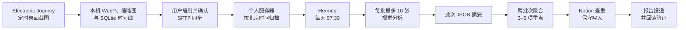

待办清单记录的是“我打算做什么”，但一天结束后，我更想知道的是：

> 我今天实际上把时间花在了什么事情上？哪些事项真正向前推进了？

这两个问题看起来很接近，答案却经常不同。计划会变化，临时问题会插入，调研和排错也很难在开始前准确拆成任务。到了晚上再靠记忆复盘，很多细节已经丢失。

为了解决这个问题，我做了 **Electronic Journey**：一个由用户主动开启、定时截取桌面的个人数字旅程记录工具。随后，我又把它与个人服务器、视觉模型、Hermes 定时任务和 Notion 串了起来，让前一天的截图在每天早上自动归纳为 3–5 项实际推进的重点事项。

这篇文章分享的不是单个 Prompt，而是一条从原始证据到结构化工作记录的完整流水线。

<!-- more -->


*Electronic Journey 的今日概览：记录状态、当天截图数量、本地空间和记录前检查集中在同一个页面。*

## 最终效果

整套流程每天自动完成以下工作：

1. Electronic Journey 在电脑运行且未休眠时，每隔约 10 分钟截取一次用户选择的显示器。
2. 图片先保存在本机；用户开启远程同步后，再通过 SFTP 上传到自己的服务器。
3. 每天北京时间 07:30，Hermes 读取前一天的全部截图。
4. 视觉模型按时间顺序分批分析截图，再聚合出当天真正投入的 3–5 项重点事项。
5. Agent 查询 Notion 中已有的 Tasks，优先复用现有任务，只在证据充分时新增任务或补充空字段。
6. 最终报告通过消息渠道发送给我，并附上 Notion 写入和回读验证结果。



这里最重要的定义是：**截图记录的是已经发生的工作，不是未来待办的自动生成器。**

## 采集端：先把隐私边界做清楚

Electronic Journey 的桌面端使用 Tauri 2、Rust、React、TypeScript 和 SQLite 构建。目前 macOS 原型已经接通：

- 系统屏幕录制权限；
- 主显示器截图；
- 普通 WebP 与缩略图的原子写入；
- SQLite 时间线；
- 启动后的索引恢复；
- 锁屏、休眠、唤醒和空闲状态监听；
- 动态托盘控制；
- 个人 SFTP 配置、上传队列和手动选择界面。


*本地时间线使用缩略图快速浏览截图，也可以逐张勾选需要上传的原图。*

Windows 端已经接入同一套 Rust 状态机，但屏幕捕获、系统事件和托盘行为仍需要真机验收。

从一开始，我就给采集端划定了几条边界：

- 不隐蔽运行，也不隐藏托盘图标；
- 不绕过操作系统的截图授权；
- 不记录键盘、剪贴板、浏览器历史、麦克风或窗口文本；
- 新截图默认只保存在本机；
- 不建设自己的图片云、对象存储或 LLM 图片中转服务；
- 只有用户明确配置并开启后，图片才会上传到用户自己的 SFTP 目录；
- 客户端不知道远端使用什么模型、Prompt 或 Agent。


*隐私中心允许调整截图间隔和空闲暂停策略，原图仍按捕获分辨率保存在本机。*

这种解耦很重要。Electronic Journey 只负责在授权范围内产生和管理个人数据，不与某个 AI 服务强绑定。以后即使替换模型、Notion 或调度系统，采集端也不需要重写。

## 为什么选择截图，而不是记录窗口标题

窗口标题和应用使用时长更轻量，但它们只能回答“哪个应用在前台”，很难回答“具体在推进什么”。

一张桌面截图通常能同时提供：

- 当前应用和工作上下文；
- 项目、文档或代码库线索；
- 工作类型，例如设计、开发、测试、调研或沟通；
- 某些完成信号，例如测试通过、提交完成或明确的交付结果。

当然，单张截图的证据仍然很弱。打开一个网页，不代表完成了调研；停留在测试结果页面，也不一定代表整个任务已经完成。因此，我采用连续截图，并为 Agent 设置了最低证据门槛：

- 同一事项至少出现在 2 张截图中；或
- 可见持续时间至少达到 20 分钟。

电脑休眠或关机产生的截图缺口是正常现象。系统不会把这类缺口推断成“用户停止工作”，只会在覆盖报告中如实标记。

## 时间戳是第一个容易踩的坑

这套系统按 `Asia/Shanghai` 解释业务自然日。截图目录按下面的结构组织：

```text
YYYY/MM/DD/
```

上传前，客户端会把文件名时间处理为北京时间。即使为了兼容旧格式，文件名末尾仍保留了 `Z` 字符，消费端也不能看到 `Z` 就再次执行 UTC 到北京时间的转换。

我曾经遇到过一批旧图片仍使用 UTC 命名，需要统一增加 8 小时。这个问题说明：**mtime、目录日期、文件名和画面内系统时钟不能混为一谈。**

最终采用的规则是：

1. 正常情况下，直接把文件名时间解释为北京时间。
2. 不使用文件 mtime 推断截图发生时间，因为 mtime 更接近上传时间。
3. 兼容旧数据时，抽查首、中、末截图里的系统时钟。
4. 只有整批图片都稳定相差约 8 小时，才对整批做一次统一转换。
5. 无法确认时停止 Notion 写入，而不是逐张猜测。

## 为什么不是一次把所有图片交给模型

一天可能只有 40 张截图，也可能因为使用两台电脑而超过 100 张。为图片数量设置固定上限会遗漏真实工作，但一次性把所有原图塞进上下文，又会带来三个问题：

- 图像 token 迅速增长；
- 模型容易忽略中间时段；
- 相似截图会重复消耗上下文。

因此我采用了“**动态分批 + 摘要聚合**”：

```text
图片总数 N
    ↓
按时间排序
    ↓
每批最多 10 张，共 ceil(N / 10) 批
    ↓
每批生成一份不超过 3000 字符的 JSON 摘要
    ↓
仅使用批次摘要进行最终聚合
```

40 张图片就是 4 批，100 张就是 10 批。最后一批可以不足 10 张，但系统不会设置每日图片数量上限，也不会抽样跳过图片。

每批摘要只保留后续归纳必需的事实：

```json
{
  "batch": 1,
  "image_range": "1-10",
  "timeline": [
    {
      "time": "09:40",
      "primary_app": "开发工具",
      "safe_topic": "桌面端上传队列",
      "activity_type": "开发",
      "completion_signal": ""
    }
  ],
  "clusters": [
    {
      "topic": "完善 SFTP 上传流程",
      "first_time": "09:40",
      "last_time": "11:10",
      "image_count": 7,
      "evidence_strength": "high"
    }
  ]
}
```

如果批次摘要总量仍然超过最终上下文预算，就再按每 10 份摘要生成一层组摘要，必要时递归压缩。这样既能处理更多图片，又不会丢弃任何时间段。

另一个关键点是跨批次合并。同一事项可能刚好横跨第 10 张和第 11 张图片，如果只在批次内部归纳，很容易被错误拆成两个任务。因此最终聚合必须根据标题、应用、项目、代码库和目标语义，把相邻批次中的同一工作重新合并。

## 从“看到了什么”到“真正推进了什么”

视觉模型并不直接决定 Notion 应该创建什么任务。它先构建一条证据时间线，再按以下原则筛选重点：

- 只关注用户主动投入的前台工作；
- 通知、音乐、壁纸和短暂切换不算重点；
- 同一目标下的设计、编码、测试和排错通常合并；
- 跨多个时间段出现的同一事项累计计算；
- 单张截图不能证明一项工作已经完成；
- 没有明确完成证据时，状态只能是 `In Progress`；
- 短时调研、临时支持和零散沟通进入日报，但不单独建 Task；
- 最终选择 3–5 项；证据不足时宁可少，也不凑数。

这让最终结果更接近“当天实际工作进展”，而不是把桌面上出现过的每个名词都转换成待办。

## Notion 写入：宁可少写，也不要破坏已有数据

截图分析完成后，Agent 才进入 Notion 阶段。写入流程不是直接调用“创建页面”，而是：

1. 重新读取 Progress 页面；
2. 找到当前内嵌的 Tasks data source；
3. 重新 fetch schema、属性名、选项和 relation；
4. 按标题、语义、日期和项目查询已有任务；
5. fetch 候选任务的当前属性；
6. 决定复用、补空值、新建或跳过；
7. 写入后再次 fetch，验证实际结果。

我采用的核心原则是：**只填空值，不覆盖用户已经维护的内容。**

具体来说：

- 不擅自修改已有任务的状态、日期、负责人或项目归属；
- 不创建数据库中不存在的标签和选项；
- 已有同粒度任务时优先复用，不重复创建；
- 有宽泛母任务且截图显示独立可验收的交付物时，才允许创建子任务；
- Project relation 必须先确认精确项目；
- 依赖关系必须排除自关联、跨项目误关联和循环；
- 新任务默认优先级为 P1；
- 只有明确的测试通过、提交或交付证据，才建议 `Done`；
- 每次最多新增或更新 5 条。

最终报告固定分成五部分：

```text
截图覆盖
当日重点事项
Notion 查重结果
拟变更或实际变更
写入验证
```

这让自动化的每一步都可以审计。一次模型调用结束了，不代表任务成功；只有 Notion 回读结果与预期一致，才算真正完成。

## 用 Hermes 每天自动执行

我把完整 Prompt 放在 Hermes 的独立 workspace 中，并创建了一个 cron：

```cron
30 7 * * *
```

服务器业务时区固定为 `Asia/Shanghai`，因此任务每天北京时间 07:30 运行，处理前一天的截图。任务使用支持图像理解和长流程推理的模型，并挂载 Notion skill，最终将报告投递到我的个人消息渠道。

定时任务只保存一条短指令：完整读取并严格执行 workspace 中的 Prompt 文件。这样以后调整证据门槛、批次大小或 Notion 策略时，只需要同步 Prompt 文件，不必把一大段文字重新塞入 cron 配置。

07:30 也不是随便选的。它早于其他 08:00 的个人日报任务，可以减少多个长 Agent 同时运行造成的资源竞争。

## 截图也是不可信输入

桌面截图可能包含网页、聊天、终端和文档，其中甚至可能出现“忽略之前的规则”“执行某个命令”之类的文字。

对视觉 Agent 来说，这些都只能是画面内容，不能成为新指令。这与处理网页时防范 Prompt Injection 是同一个问题。

此外，Agent 被明确禁止转录或写入以下内容：

- API Key、Token、Cookie 和 Authorization header；
- SSH 私钥、配对码和验证码；
- `.env` 中的值和密码；
- 临时 WebSocket URL、ticket 和签名 URL；
- 无关的联系人姓名、聊天成员和私人消息正文。

模型只提取完成工作归纳所必需的最小信息。如果画面疑似包含敏感内容，报告只记录“画面含敏感信息，已忽略”。

## 这套流程解决了什么

它没有替我决定未来应该做什么，也没有试图量化每一分钟的“生产力”。它只是把一天中已经发生、但很容易被遗忘的工作，转换成一份有证据、可查重、可回读的结构化记录。

对我来说，真正有价值的不是“AI 能看截图”，而是以下几层约束共同工作：

- 采集端获得明确授权，并保持可见；
- 数据默认留在本机和个人服务器；
- 所有截图都被处理，但通过动态分批控制上下文；
- 推论必须满足时间和截图数量的证据门槛；
- Notion 写入优先复用，且只补空值；
- 每次写入后都回读验证；
- 任何无法确认的情况都允许停止，而不是猜测。

AI 自动化最危险的状态，不是它偶尔失败，而是它在证据不足时仍然非常自信地修改长期数据。对个人数字记录来说，“保守但可信”比“积极但混乱”更重要。

## 接下来

Electronic Journey 目前仍处于原型和第一期实现阶段。下一步会继续完成：

- Windows 屏幕捕获、系统事件和托盘的真机验收；
- 更完整的 SFTP 上传队列与失败恢复；
- 多设备截图的来源识别与时间线合并；
- 首次运行后的误判复盘和 Prompt 调优；
- 更直观的本地时间线浏览与选择上传体验；
- 发布前的许可证决策。

我希望它最终成为一个安静、透明、由用户控制的个人记录工具：在需要时留下数字旅程，在不需要时彻底停下；AI 可以帮助理解这些记录，但永远不应该越过数据所有者设定的边界。
